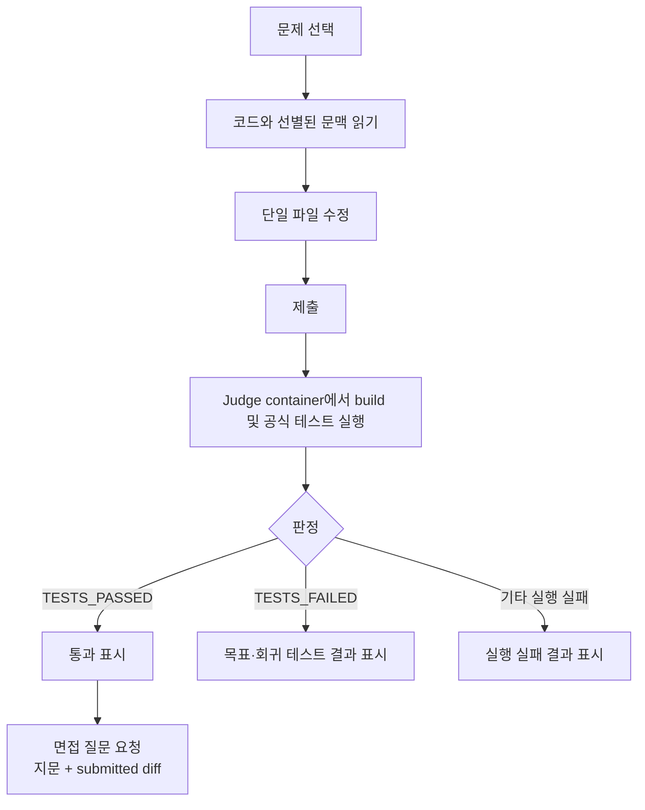
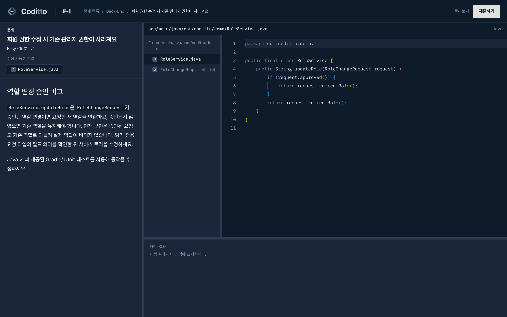
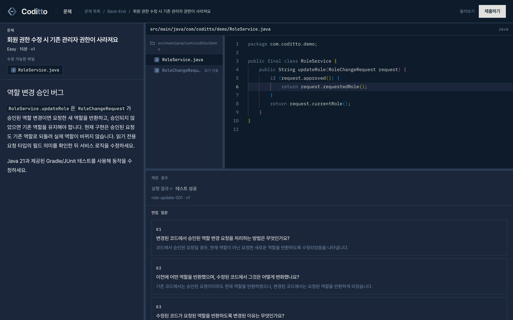
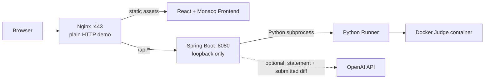

<p align="center">
  <picture>
    <source media="(prefers-color-scheme: dark)" srcset="docs/assets/coditto-symbol-dark.svg">
    
  </picture>
</p>

<h1 align="center">Coditto</h1>

<p align="center">
  기존 코드를 읽고, 버그를 수정하고, 테스트로 수정이 기존 동작을 깨뜨리지 않았는지 검증하는 디버깅 훈련 서비스
</p>

**AI가 정답을 판정하지 않습니다.** 제출한 코드는 격리된 환경에서 실제로 빌드되고, 공식 테스트의 실행 결과로 판정됩니다.

**[데모 열기](http://1.201.116.237:443)** — 로그인 없이 바로 풀 수 있습니다.

## Motivation

AI 코딩 도구가 코드를 빠르게 생성할 수 있게 되면서, 생성된 코드를 읽고 검증하는 능력도 함께 중요해졌습니다. 코드가 그럴듯하게 동작하는 것과, 요구사항을 만족하면서 기존 동작을 깨뜨리지 않는 것은 다릅니다.

Coditto는 그 능력을 디버깅 과제로 훈련합니다. 기능을 처음부터 구현하는 대신, 이미 있는 프로젝트에서 잘못된 지점을 찾아 고치고, 그 수정이 안전한지 테스트로 확인하고, 왜 그렇게 고쳤는지 설명하게 합니다.

## Workflow



수정할 수 있는 파일은 하나이고, 문제별로 선별된 주변 파일은 읽기 전용 문맥으로 함께 보여 줍니다. 제출한 소스는 격리된 Judge container에서 빌드되고 공식 테스트를 거칩니다. 테스트가 완료되면 `TESTS_PASSED` 또는 `TESTS_FAILED`로 판정되며, `TESTS_FAILED`는 목표 테스트와 회귀 테스트 중 어느 쪽이 깨졌는지 나눠 보여 줍니다. 컴파일·시간·자원·요청·시스템 실패는 별도 실행 실패 결과로 표시하고, 통과하면 지문과 수정 diff로 만든 면접 질문 세 개가 붙습니다.

## Demo

`http://1.201.116.237:443`에서 실행 중입니다.

**작업공간** — 문제 지문, 선별된 프로젝트 파일 트리, 에디터를 한 화면에서 확인합니다. 수정할 수 있는 파일은 하나이고 나머지는 읽기 전용 문맥입니다.



**채점 결과** — 제출하면 목표·회귀 테스트 결과가 표시되고, 통과한 제출에는 수정 diff로 만든 면접 질문이 붙습니다.



## Features

- **프로젝트 코드 기반 문제.** 공개 PBL 저장소 기반 11개와 Coditto demo fixture 1개로, 프로젝트 문맥을 읽고 원인을 추적해야 하는 디버깅 과제를 구성했습니다.
- **단일 파일 수정과 읽기 전용 문맥.** 고칠 파일은 하나지만 선별된 주변 코드를 함께 읽어야 원인을 찾을 수 있습니다.
- **실행 가능한 테스트가 판정.** AI 채점이 아니라 격리된 Judge container에서 실제로 돌린 빌드와 테스트가 근거입니다.
- **목표와 회귀 구분.** 새로 고쳐야 할 동작이 실패했는지, 기존 동작을 깨뜨렸는지 나눠 알려 줍니다.
- **수정 diff 기반 면접 질문.** 통과한 제출에 한해 왜 그렇게 고쳤는지 묻습니다. 채점하지 않습니다.

## Architecture



Judge container는 네트워크를 차단하고 non-root·read-only·capability 제거 같은 제한을 적용해 실행하며, 공식 테스트의 상세 내용은 API와 작업공간 응답에 노출하지 않습니다. 적용한 옵션과 근거는 [Judge 입출력 명세](docs/contracts/judge.md)에 있습니다.

면접 질문 생성은 판정 경로와 분리돼 있어, `OPENAI_API_KEY`가 없거나 생성에 실패해도 판정 결과는 그대로 남습니다.

구현 순서와 모노레포 경계는 [기술 아키텍처](docs/ARCHITECTURE.md)에 있습니다.

## Current Scope

문제를 골라 코드를 고치고, 제출해 실제 테스트 결과를 받고, 통과하면 면접 질문을 받는 흐름까지 동작합니다.

| | |
|---|---|
| 문제 | 12개 (Java 6개, Java · Spring 6개) |
| 예상 풀이 시간 | 한 문제 15~30분 |
| 판정 소요 시간 | Java p50 약 6초, Spring p50 약 11초 (배포 서버, 정상·오답 각 5회) |
| 런타임 | Java 21, Gradle 8.10.2, JUnit, H2 |

현재 공개 데모는 무제한 다중 사용자 운영을 전제로 하지 않습니다.

- 사용자 인증과 서버 측 제출 이력 저장 미지원. 진행 상태는 브라우저에만 남습니다
- 전역 동시 판정 수 제한과 대기열 미지원
- TLS 미적용. 공개 주소는 평문 HTTP이고 포트를 포함합니다
- 제출 코드 격리는 Docker 기반이며, 공개 임의 코드 실행을 위한 강한 sandbox는 현재 범위에 포함하지 않음

## Getting Started

실행에는 Docker Desktop, Java 21, Node.js 24, Python 3가 필요합니다. Docker Desktop의 Client와 Server가 모두 실행 중이어야 하며, Node 버전은 `frontend/.nvmrc`와 `frontend/package.json`의 `engines`에 고정돼 있습니다.

Judge 실행에 필요한 Docker 이미지를 최초 1회 빌드해야 합니다.

```bash
./deploy/scripts/build-judge-images.sh
```

```bash
# Backend
cd backend
./gradlew bootRun

# 별도 터미널: Frontend
cd frontend
npm install
npm run dev
```

`http://localhost:5173`에서 열립니다. `/api` 요청은 Vite proxy가 Backend `http://localhost:8080`으로 넘깁니다. 면접 질문의 OpenAI 호출은 선택 사항이며 `OPENAI_API_KEY`가 비어 있으면 외부 요청 없이 `UNAVAILABLE`을 반환합니다.

## Verification

저장소 root에서 그대로 실행할 수 있습니다.

```bash
(cd backend && ./gradlew test)
(cd frontend && npm test && npm run build)
python3 -m unittest discover -s judge-runner/tests
```

Judge 실검증과 판정 소요 시간 측정 절차는 [Judge 검증 절차](docs/judge-verification.md)에 있습니다.

## Roadmap

- 사용자의 Codex 또는 Claude Code 환경과 연결한 문제 풀이 흐름
- 공개 GitHub 프로젝트를 기반으로 한 개인화 문제
- AI가 문제 후보를 만들고 Judge가 실행 가능성과 요구 조건 충족 여부를 검증하는 과정
- 알고리즘 문제와 다른 개발 역량을 평가하는 디버깅 과제 형식

## Documentation

- [기술 아키텍처](docs/ARCHITECTURE.md)
- [Judge 입출력 명세](docs/contracts/judge.md)
- [Judge 검증 절차](docs/judge-verification.md)
- [가비아 VPS 첫 배포 가이드](docs/deployment.md)
- [문제 콘텐츠 품질 기준과 재평가 기록](docs/problem-quality-issue-15.md)
- [Issue #27 PBL 문제 선정 기록](docs/problem-selection-issue-27.md)
- [기여 및 협업 규칙](CONTRIBUTING.md)
- [저장소 작업 규칙](AGENTS.md)
